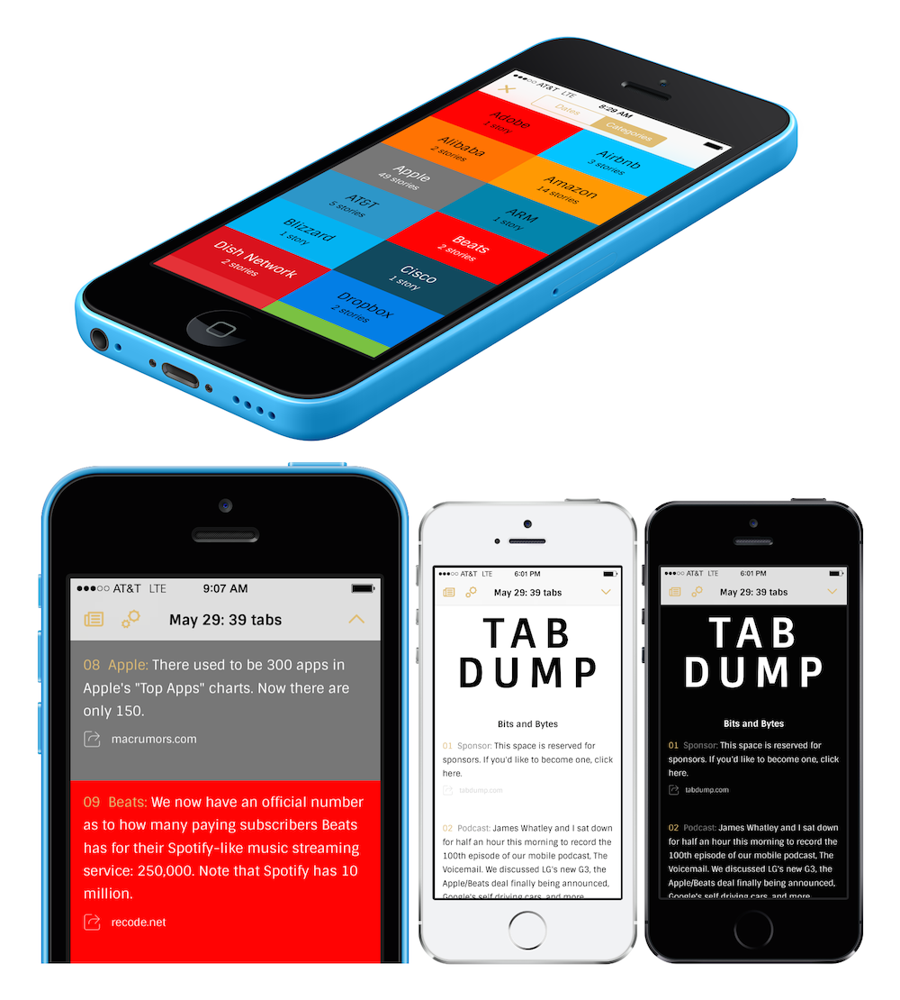

TabDump For iOS
---------------

Read http://tabdump.com by **Stefan Constantinescu** ([@WhatTheBit](https://twitter.com/WhatTheBit)) on your iOS device. Download on [the App Store](https://itunes.apple.com/us/app/tab-dump/id868214144).

# Features

- Read next: ⬇ button skips to the next story
- Night mode
- Multiple text size
- Share a story: Reading List, Message (iMessage, SMS), Email, Facebook, Twitter, [Buffer](https://bufferapp.com/app) & [Drafts](http://agiletortoise.com/drafts/) (URL scheme)
- Category browsing (and category colors)
- Keep track of Tab Dumps read

# Libraries

- [AFNetworking](http://afnetworking.com/)
- [AFOnoResponseSerializer](https://github.com/AFNetworking/AFOnoResponseSerializer)
- [BrandColors](https://github.com/dkhamsing/BrandColors)
- [DKCategories](https://github.com/dkhamsing/DKCategories)
- [DKUserMessageView](https://github.com/dkhamsing/DKUserMessageView)
- [Ono](https://github.com/mattt/Ono)
- [SpinKit-ObjC](https://github.com/devenergy/SpinKit-ObjC)
- [TOWebViewController](https://github.com/TimOliver/TOWebViewController)

# Design

- App Icon: [Lex Postma](http://www.lexpostma.me)
- Navigation Assets: [Thomas Le Bas](http://thomaslebas.com)
- Fonts: [Eduardo Tunni](http://www.tipo.net.ar)

# Compatibility

- This project uses ARC.
- This project was tested with iOS 7 (iPhone & iPad).

# TODO

- https://trello.com/b/sC4juPme/tabdump

# Thanks

[Stefan Constantinescu](http://tabdump.com), [Galen Gidman](http://brandcolors.net) and the [wonderful people](https://github.com/stars/dkhamsing) who contribute to open source software.

# Contact

- Daniel Khamsing
- GitHub: [@dkhamsing](https://github.com/dkhamsing)
- Twitter: [@dkhamsing](https://twitter.com/dkhamsing), [@tabdumpios](https://twitter.com/tabdumpios)
- [Send a Message](http://dkhamsing.tumblr.com/ask)

# License

TabDump is available under the MIT license. See the LICENSE file for more info.